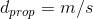
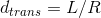
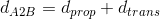
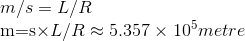
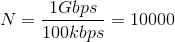
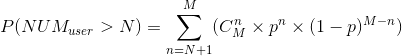
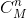
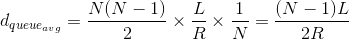
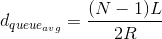

> 若表达式无法显示，请尝试刷新页面、选用其他浏览器阅览等方法。
>
> 若尝试后仍无法看到表达式，请直接查阅 homework.md 同级目录下的 *.gif 文件。

### 第一章

#### P6

a: 

b: 

c: 

d: 此时，最后一个比特刚刚离开A或即将离开A

e: 此时，第一个比特在链路中的某个位置

f: 此时，第一个比特在B

g: 

***

#### P9

a:

当使用电路交换时，能被同时支持的最大用户数量：

b:

多于N用户发送数据的概率即N+1用户发送数据的概率、N+2用户发送数据的概率、……、M用户发送数据的概率之和：

其中，代表从M中选出n的组合数。

***

#### P13

a: 

简单分析一下，传输的第一个分组排队时延为0，第二个分组的为一倍的L/R，第三个分组的为两倍的L/R，第四个分组的为三倍的L/R，……，第N个分组的为（N-1）倍的的L/R，即一个等差数列。综上，平均排队时延为：

b:

很显然，LN/R刚好可以让N个分组全部传输完，因此，每N个分组传输完毕，另外N个分组才会到达，相互之间没有影响。所以，一个分组的平均排队时延同上：

