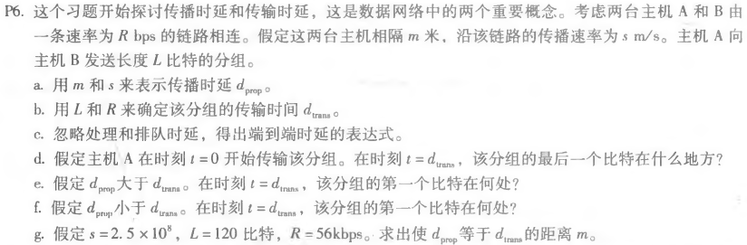
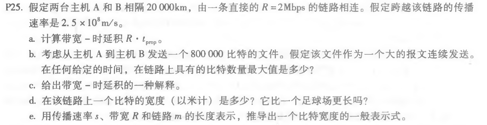

###### 2017301530080王润泽 homework1
## P5

回顾在1.4节中的车队的类比。假定传播速度为100km/h
**a.**假定车队旅行150km：在一个收费站前面开始，通过第二个收费站，并且正好在第三个收费站后 面结束。其端到端时延是多少？
**b.**重复（a）,现在假定车队中有8辆汽车而不是10辆。

## Answer

**a**. 

收费站处理时间 ***d1=12s\*10 = 120s=2 min***

传输时延***d2 = 150km/(100km/h) = 1.5h = 90 min***

端到端时延***d = d2 +3\*d1 = 96min***

**b.**

收费站处理时间 ***d1=12s\*8 = 96 s***

传输时延***d2 = 150km/(100km/h) = 1.5h = 90 min***

端到端时延***d = d2 +3\*d1 = 90min + 288s =94 min 48 s***

---

## P6

#### Answer

**a**.  **m/s**

**b**. **L/R**

**c**.  **m/s + L/R**

**d**. 刚离开主机A

**e**. 在A和B传输的链路上还未到达B

**f**. 已经到达B

**g**. 
$$
\frac {m}{2.5*10^8} = \frac{120}{56000}
$$
可得**m=535714.286** 米

---
## P25

## Answer

**a**.  
$$
t_ {prop} = \frac {m} {s} = \frac {20000km}{2.5 * 10 ^ {8} m / s} = 0.08 s
$$
$$
R·t_ {prop} = 2Mbps*0.08s=0.16Mb
$$
**b**.  0.16Mb

**c**.   链路上最大比特数量 

**d**.  
$$
d = \frac {2 *10^{7}} {1.6*10^{5}} = 125m
$$
**e**. 
$$
t_ {prop} = \frac {m} {s}
$$
$$
带宽-时延积= R·t_{prop}
$$
$$
d=\frac{m} {R·t_{prop}} = \frac {m} {R·\frac {m}{s}} = \frac {s}{R}
$$
$$
d=\frac {s}{R}
$$

---

