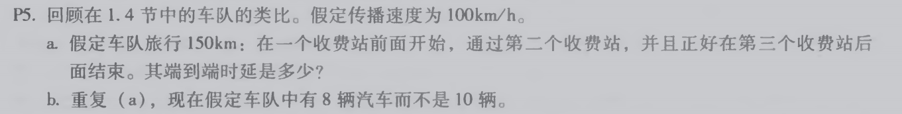
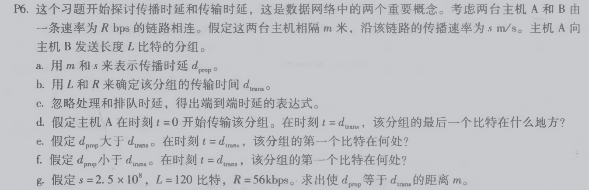
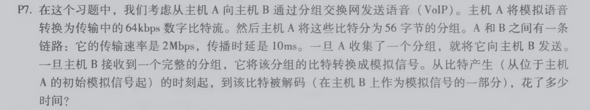

# 网络及分布式计算作业2

## 习题5

a. 3个收费站一共旅行150km也就是说每个收费站距离是75km，车队从第一个收费站前面开始到处理完毕需要12 * 10 = 120秒 = 2分钟的处理时间，然后从第一个收费站到第二个收费站前面需要75 / 100 = 45分钟的传播时间，然后通过第二个收费站依然需要2分钟处理时间，再从第二个收费站到第三个收费站需要45分钟传播时间，最后第三个收费站需要2分钟处理时间。一共需要2 + 75 + 2 + 75 + 2 = 96分钟

b. 和前一题一样，传播时间依然是45分钟，而处理时间变为12 * 8 = 96秒，所以一共需要96s + 45min + 96s + 45min + 96s = 94分钟48秒

## 习题6

a. m/s

b. L/R

c. m/s + L/R

d. 刚刚离开主机A

e. 在链路上传播

f. 已经到达主机B

## 习题7

从比特产生到解码需要(56 * 8)/(64 * 103) = 7ms

接着从解码之后的传输时间需要(56 * 8)/(2 * 106) = 0.224ms

然后传播到主机B的传播时间是10ms

最后有一个问题是，这道题目是否考虑主机B的解码时间，如果不考虑的话总时间就是7 + 10 + 0.224 = 17.224ms；如果考虑的话题目并没有给出，假设是xms，那么就是(17.224 + x)ms

## 作者

软五 2017301610194 马如云
