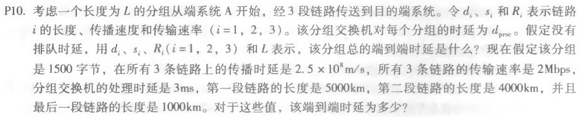
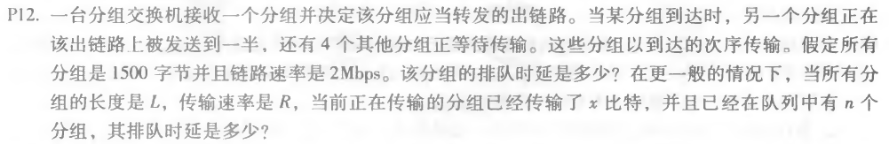

### 第二次作业

* * *

#### P10

##### 题目：

##### 作答：
总的传输时延：
Dtrans = L/R1 + L/R2 + L/R3

总的传播时延：
Dprop = d1/s1 + d2/s2 + d3/s3

总的处理时延：
Dproc = 2 * dproc

总的排队时延：
Dqueue = 0

所以总的端到端时延为：
D = Dtrans + Dprop + Dproc + Dqueue
D = L/R1 + L/R2 + L/R3 + d1/s1 + d2/s2 + d3/s3 + 2 * dproc

将假定的值带入，得：
D = 6 + 6 + 6 + 20 + 16 + 4 + 2 * 3 = 64(ms)

* * *

#### P11

##### 题目：

##### 作答：
由于比特是立即发送的，所以分组交换机不引入任何时延，尤其不引入传输时延，且处理时延Dproc = 0

所以这时总的端到端时延为：
D = L/R + d1/s1 + d2/s2 + d3/s3

将假定的值带入，得：
D = 6 + 20 + 16 + 4 = 46(ms)

* * *

#### P12

##### 题目：

##### 作答：
该分组还需等待前面的其他分组，一共4.5个分组，4.5*1500字节 = 6750字节 = 54000bit
所以该分组排队时延：Dqueue = 54000bit / 2Mbps = 27ms

更一般的情况：
该分组排队时延：Dqueue = (L - x + nL) / R

* * *
