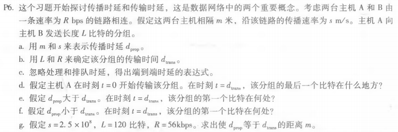
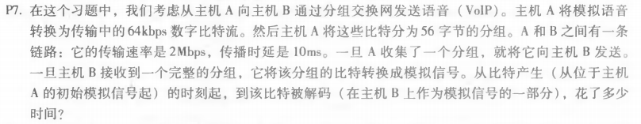

# HOMEWORK-2

### ***选择的题目为书上的：P2，P6，P7***

### problem_1

### answer_1

​		根据式（1-1），该条件下一个分组的端到端时延为：T0 = N * (L / R)。设现在有P (P > 1)个分组，当第一个分组到达目的地时，第二个分组还差1段链路，第三个分组还差2段链路......以此类推可知，最后一个分组还差(P - 1)段链路。所以最后一个分组到达目的地还需要的时间为：T1 = (P - 1) * (L / R)，故而得知P个分组全部传输完成的时间为：T = T0 + T1 = (N + P - 1) * (L / R)。

​		综上所诉，一般化公式为：T = (N + P - 1) * (L / R)

### problem_2

### answer_2

		- a. *dprop* = m / s (秒)
		- b. *dtrans* = L / R (秒)
		- c. *dend-to-end* = *dprop* + *dtrans* = (m / s + L / R) (秒)
		- d. 在 t = *dtrans* 时刻，该分组的最后一个比特刚好离开主机A
		- e. 在此情况下，分组的第一个比特已经离开主机A，并且在链路中传播，但是还未到达主机B
		- f. 在此情况下，分组的第一个比特已经到达主机B
		- g. 令 *dprop* = m / s = *dtrans* = L / R ，代入数值解得：m = *535.71* km

### problem_3

### answer_3

* 比特产生需要时间为：t1 = (56 * 8) / (64 * 103) = 7 ms
* 解码之后的传输时间为：t2 = (56 * 8) / (2 * 106) = 0.224 ms
* 从主机A到主机B的传播时间为：t3 ＝10 ms
* 所以总用时为：t = t1 + t2 + t3 = 17.224 ms

