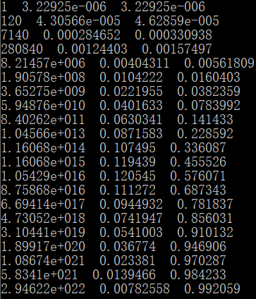

# homework2

P8

a)当使用电路交换时，最多支持3m/150k=20个用户

b)10%=0.1

c)nC120 x 0.9(120-n) x 0.1n

d)编写程序计算得小于21个用户的概率为0.992959，则大于等于21个用户的概率是0.007041

P24

传输时长为40 * 1012 * 8 / (100M) = 3.2 * 106 sec，远远大于夜间快递所耗费的时间

P29

a)同步卫星轨道高约36000km，地球半径约为6000km，相距约为30000km，即3 * 107 m

传播时延为3 * 107 / 2.4 / 108 = 0.125 sec

b)带宽-时延积R - Dpmp是10Mbps * 0.125s = 1.25Mb

c)10Mbps * 60s = 600Mb

