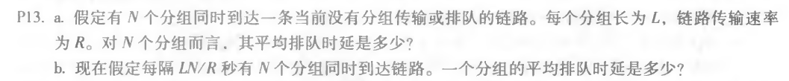

# 第二周作业

选取课后第**P5、P13**作为本次作业：

> 

> 
>
> 
>
> > **解答**:
> >
> > + **P5:**
> >
> >   收费亭相距75公里，车辆以每小时100公里的速度传播。收费亭每12秒为一辆汽车提供服务。
> >
> >   a. 有10辆车。第一个收费站服务这10辆车需要120秒钟，也就是2分钟。每辆汽车在到达第二个收费站之前都有45分钟的传播延迟(行驶75公里)。因此，在47分钟后的第二个收费站前，所有的汽车都排好了队。整个过程重复在第二个和第三个收费亭之间旅行。第三个收费站还需要2分钟才能为10辆车提供服务。因此，总的延迟时间是96分钟。
> >
> >   收费站将整个车队推向公路的时间为 d1 = 2min；
> >
> >   两收费站之间距离 75 km，从一个收费站到另一个的时间 d2 = 0.75 h
> >
> >   总时间 d = 3d1 + 2d2 = 96min
> >
> >   b. 收费亭之间的延误为8*12秒加上45分钟，即46分钟和36秒。总延迟是这一数额的两倍，加上8*12秒，即94分48秒。
> >
> >   d1’ = 8辆 / 5辆/min = 1.6min
> >
> >   d’ = 3d1’ + 2d2 = 94.8min
> >
> > * **P13：**
> >
> >   a. 第一个分组的排队时延是0，第二个分组是L/R......第N个分组是(N-1)L/R，由等差和公式可知，$\frac{\sum_{i=1}^{N-1}\frac{i * L}{R}}N=\frac{(N-1) * L}{R}$
> >
> >   b. 每N个分组的造成的排队时延恰好是LN/R秒，因此取每一间隔内的情况来看，与a所述情况相同。故一个分组的平均排队时延与a相同，为$\frac{(N-1) * L}{R}$

> > + **P22：**
> >
> >   不丢包概率为 1 - p， N 个路由器， 因此总的不丢包概率$p_s=(1−p)^N$
> >
> >   在客户端成功接收数据包之前需要执行的传输数是具有成功概率$p_s$的几何随机变量。因此，所需传输的平均次数为：$1/ps$。然后，所需重传的平均次数为：$1/p_s-1$。