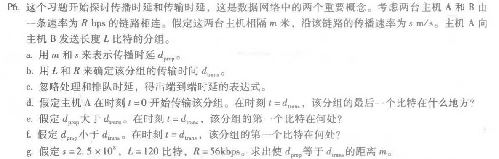
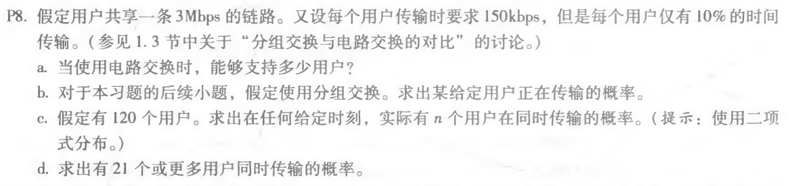
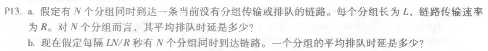

# 第二次作业

[toc]

### p6

**a.**

dprop = m / s

**b.**

dtrans = L / R

**c.**

d = dprop + dtrans = m / s + L / R

**d.**

最后一比特刚好离开A

**e.**

在链路上，距离A：s * dtrans

**f.**

已经到达了B

**g.**

即m /s = L/R，m = 53571米

### p8

**a.**

能够支持 3Mbps / 150kbps = 20 个用户

**b.**

因为只有10%的时间正在传输，所以特定用户正在传输的概率为 0.1

**c.**

利用二项式分布：
$$
\binom{120}{n}{p^n}({1-p})^{120-n}
$$
**d.**

即 **1 - p(最多有20个用户同时传输)**
$$
1-\sum_{i=0}^{20}(\binom{120}{i}{p^i}({1-p})^{120-i})
$$

### p13

**a.**

第一个分组排队时延为0，第二个分组排队时延为L/R，第三个分组为2L/R。。。最后一个分组为(N-1)L/R，

所以平均排队时延为 (0+L/R+2L/R+...+(N-1)L/R) / N = **(N-1)L/2R**

**b.**

N个分组全部传输完的时间为① 
$$
\frac{LN}{R}
$$
而时间间隔为②
$$
\frac{LN}{R}
$$

所以前面N个分组刚好传完时，后面N个分组到达，所以平均排队时延还是：
$$
\frac{L(N-1)}{2R}
$$

