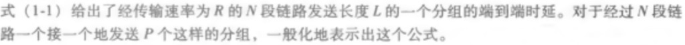
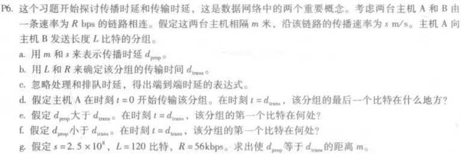
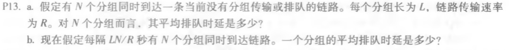

#### P2.

答：

N段链路可以给包括源端和目的端的地点编号1，2，3......N+1

- 当第一个分组到达端N+1时，第二个分组到达端N，以此类推，第P个分组到达端N+2-P时，所用时间(根据公式1-1)      **T1 = NL/R**

- 考虑当第P个分组到达端N+2-P时，要到达端N+1，所需时间(根据公式1-1)T2 =（ N+1-（N+2-P））L/R=（P-1）L/R，而此时其余分组一定全部到达端N+1  **T2=（P-1）L/R**
- **T = T1+T2 =（N+P-1）L/R**

#### P6.

答：

**a.** d~prop~=m/s

**b.** d~trans~=L/R

**c.** d = d~prop~+d~trans~= m/s+L/R

**d.**  刚刚离开A

**e.** 在链路上

**f.** 到达主机B

**g.** m/s=L/R, m = Ls/R = 5.36 *10^5^m

#### P13.

答：

**a.**

- 第一个分组 d ~queue~=0

- 第二个分组d ~queue~=L/R

- ......

- 第n个分组d ~queue~=(n-1)L/R

  平均d ~queue~=(L/R+.....(n-1)L/R)/n=(1+n-1)(n-1)L/2nR=(n-1)L/2R

**b.** 传输n个分组需要LN/R秒，当每批到达时，缓冲区为空，一个分组的平均排队时延为第一批次的平均时延 (n-1)L/2R

