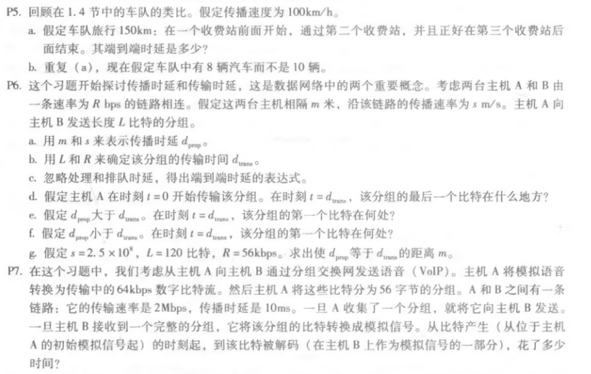

# 第二次作业

## 题目

## 解答

~~~
P5
(a)
收费站间距150/2=75km
单收费站处理12*10=120s=2min
单间距移动75/100=0.75h=45min
一共用时2+45+2+45+2=96min
(b)
处理时间变成12*8s=1.6min
一共用时1.6+45+1.6+45+1.6=94.8min=94min48s
~~~

~~~
p6
(a)dprop=m/s
(b)dtrans=L/R
(c)dprop+dtrans=m/s+L/R
(d)最后一个比特刚好离开主机A
(e)第一个比特还在链路上进行传输，但没到达主机B
(f)第一个比特已经到达主机B
(g)m/(2.5*10^8)=120/(56*1000)~=535714m~=535.7km
~~~

~~~
p7
以一个分组为单位进行计算
主机A将模拟信号转换成数字信号用时：(56*8)/(64*1000)=7/1000s=7ms
数字信号到传输：(56*8)/(2*10^6)=0.224ms
传输时延：10ms
主机B将数字信号转换为模拟信号用时未知，假设用时t(ms)
共用时：7+0.224+10+t=(17.224+t)ms
~~~

