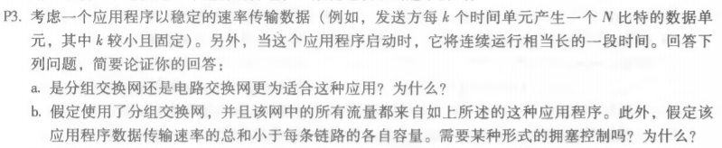
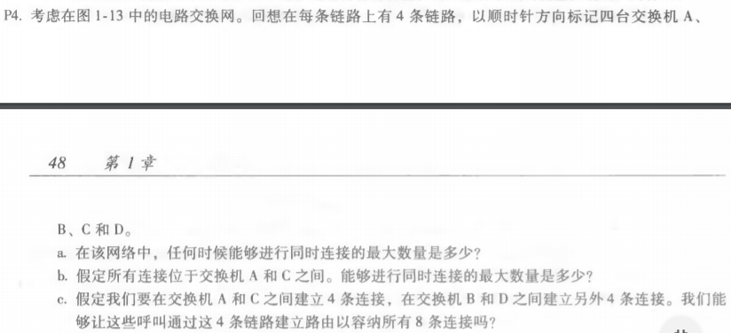
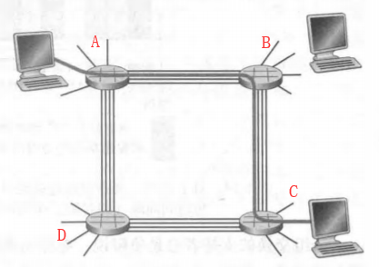
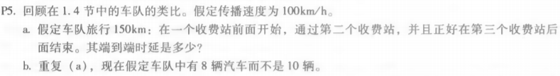

<h1>Homework2</h1>

<b>		选择习题题目为：P3、P4、P5以及P22，这些习题覆盖了课堂上讲到的关于分组交换、电路交换、时延以及丢包等知识。</b>

# 1. P3

   </img>

### a. 

​		该应用采用电路交换网更为适合。
​		分组交换采用非存储转发传输方式，将一个长报文先分割为若干个较短的组，然后把这些分组逐个发送；而电路交换在通讯之前要在通信双方之间建立一条被双方独占的物理通路，具有传输数据时延低的优点。
​		由题目描述可知：发送方每k个时间单元产生一个N比特数据单元，k较小且固定；应用启动时，会连续运行很长时间。这些说明该应用传输的数据量很大，因此需要为其保留带宽，所以采用电路交换网更为适合。

### b.

​		不需要。
​		分组交换的拥塞控制是为了防止因输入流量（负荷）长时间的地连续超过规定值而产生网路拥塞所采取的控制手段。题目中提到应用程序传输速率的总和小于每条链路的各自容量，因此不需要拥塞控制。

# 2. P4

   </img>
   </img>

### a.

​		任意两个相邻交换机之间均有四个连接，因此该网络能够进行同时连接的最大数量是4 + 4 + 4 + 4 = 16个。

### b.

​		所有连接位于交换机A和C之间，则中间经过的交换机为B或者D，因此能够同时连接的最大数量是8。

### c.

​		可以。
​		对于交换机A和C之间的4条连接：A->B->C、A->B->C、A->D->C、A->D->C;
​		对于交换机B和D之间的4条连接：B->A->D、B->A->D、B->C->D、B->C->D.

# 3. P5

    

### a.

​		由1.4节说明可知，收费站将整个车队推推向公路所需要的时间是（10辆）/（5辆车/min）2min，因此该车队在收费站花费的时间为：2 * 3 = 6min。该车队旅行150km，所需时间为：150 / 100 = 1.5h = 90min。因此端到端的时延为：6 + 90 = 96min。

### b.

​		该车队在收费站花费的时间为：（8/5）*3 = 4.8min，此时端到端的时延为：4.8 + 90 = 94.8min。

# 4. P22

    

​		假设服务器与客户之间有n个链路，一个分组成功地被接收方收到的概率是：(1-p)^n。为了使客户成功地接收该分组，服务器重传分组次数为：1/((1-p)^n) - 1。
