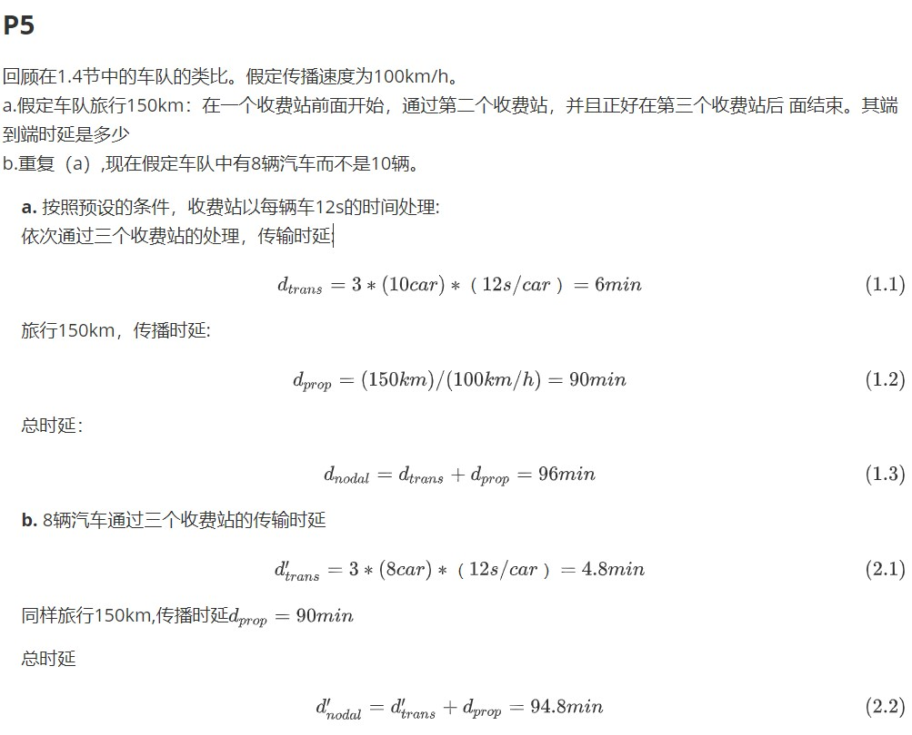
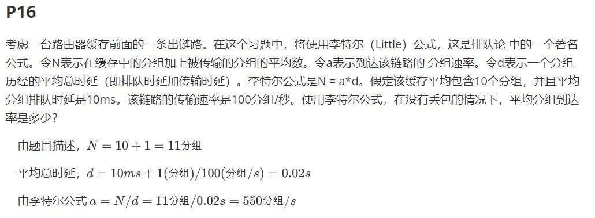
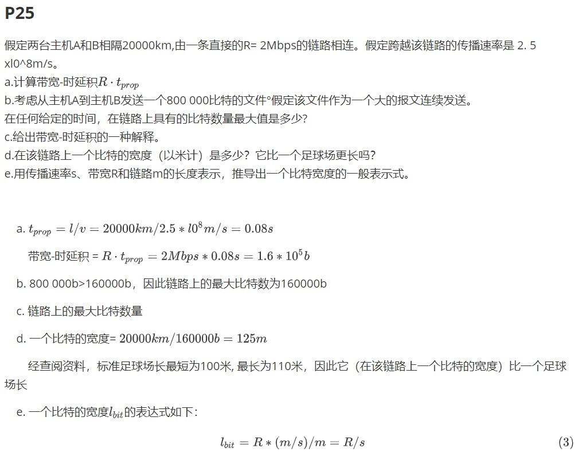

## 网络及分布式计算作业（二）

*由于github不支持LaTeX解析，以下为截图，源内容附在末尾*

***

以下为含LaTeX公式的源内容

### P5

回顾在1.4节中的车队的类比。假定传播速度为100km/h。
a.假定车队旅行150km：在一个收费站前面开始，通过第二个收费站，并且正好在第三个收费站后 面结束。其端到端时延是多少
b.重复（a）,现在假定车队中有8辆汽车而不是10辆。

​	**a.** 按照预设的条件，收费站以每辆车12s的时间处理:
​	依次通过三个收费站的处理，传输时延:
$$
d_{trans}=3 * (10car)*（12s/car）=6 min\tag{1.1}
$$
​	旅行150km，传播时延:
$$
d_{prop}=(150km)/(100km/h)=90min\tag{1.2}
$$
​	总时延：
$$
d_{nodal}=d_{trans}+d_{prop}=96min\tag{1.3}
$$
​	**b.** 8辆汽车通过三个收费站的传输时延
$$
d_{trans}'=3 * (8car)*（12s/car）=4.8 min\tag{2.1}
$$
​	同样旅行150km,传播时延$d_{prop}=90min$

​	总时延
$$
d_{nodal}'=d_{trans}'+d_{prop}=94.8min\tag{2.2}
$$

### P16

考虑一台路由器缓存前面的一条出链路。在这个习题中，将使用李特尔（Little）公式，这是排队论 中的一个著名公式。令N表示在缓存中的分组加上被传输的分组的平均数。令a表示到达该链路的 分组速率。令d表示一个分组历经的平均总时延（即排队时延加传输时延）。李特尔公式是N = a*d。假定该缓存平均包含10个分组，并且平均分组排队时延是10ms。该链路的传输速率是100分组/秒。使用李特尔公式，在没有丢包的情况下，平均分组到达率是多少？

​	由题目描述，$N=10+1=11\text{分组}$

​	平均总时延，$d=10ms+1(分组)/100(分组/s)=0.02s$

​	由李特尔公式 $a = N/d = 11分组/0.02s=550分组/s$

### P25

假定两台主机A和B相隔20000km,由一条直接的R= 2Mbps的链路相连。假定跨越该链路的传播速率是 2. 5 xl0^8m/s。
a.计算带宽-时延积$R·t_{prop}$
b.考虑从主机A到主机B发送一个800 000比特的文件°假定该文件作为一个大的报文连续发送。
在任何给定的时间，在链路上具有的比特数量最大值是多少?
c.给出带宽-时延积的一种解释。
d.在该链路上一个比特的宽度（以米计）是多少？它比一个足球场更长吗？
e.用传播速率s、带宽R和链路m的长度表示，推导出一个比特宽度的一般表示式。

​	a. $t_{prop}=l/v=20000km/2. 5 *l0^8m/s=0.08s$

​		带宽-时延积 = $R·t_{prop}=2Mbps*0.08s=1.6*10^5b$

​	b. 800 000b>160000b，因此链路上的最大比特数为160000b

​	c. 链路上的最大比特数量

​	d. 一个比特的宽度= $20000km/160000b=125m$

​		经查阅资料，标准足球场长最短为100米, 最长为110米，因此它（在该链路上一个比特的宽度）比一个足球场长

​	e. 一个比特的宽度$l_{bit}$的表达式如下：
$$
l_{bit}=R*(m/s)/m=R/s\tag{3}
$$

