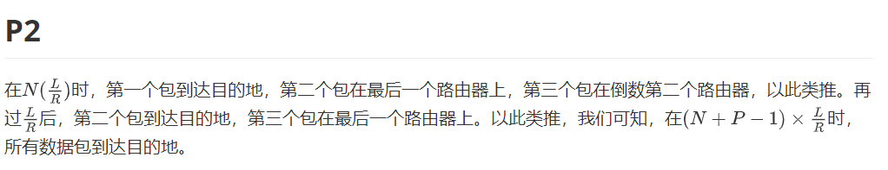
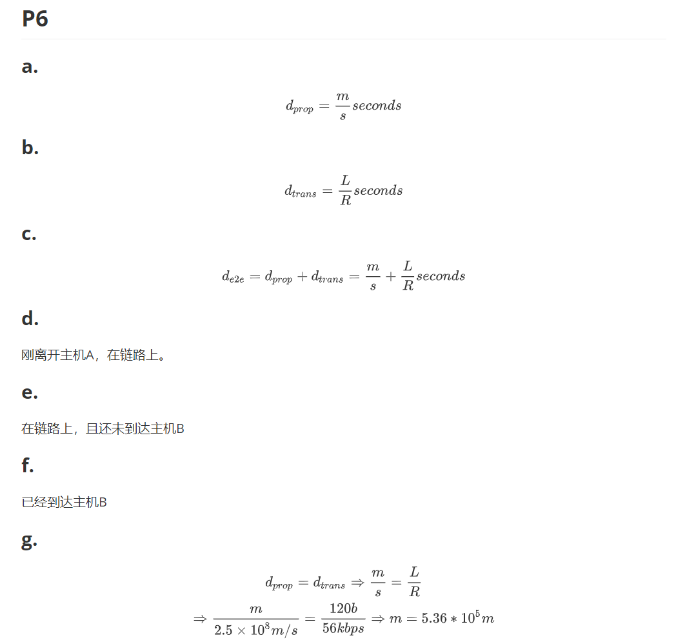
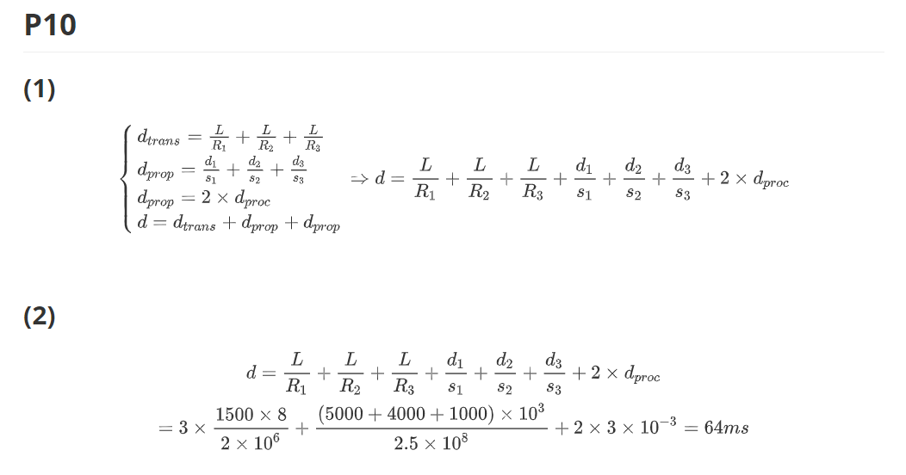

# 网络及分布式 第二次作业

*以防使用不支持LaTeX解析的Markdown软件，因而如若上面的LaTeX源码无法显示，可往下翻，有截图版。*

## LaTeX版

### P2

在$N(\frac{L}{R})$时，第一个包到达目的地，第二个包在最后一个路由器上，第三个包在倒数第二个路由器，以此类推。再过$\frac{L}{R}$后，第二个包到达目的地，第三个包在最后一个路由器上。以此类推，我们可知，在$(N+P-1) \times \frac{L}{R}$时，所有数据包到达目的地。

### P6

#### a.

$$
d_{prop} = \frac{m}{s} seconds
$$

#### b.

$$
d_{trans} = \frac{L}{R} seconds
$$

#### c.

$$
d_{e2e} = d_{prop} + d_{trans} = \frac{m}{s} + \frac{L}{R} seconds
$$

#### d.

刚离开主机A，在链路上。

#### e.

在链路上，且还未到达主机B

#### f.

已经到达主机B

#### g.

$$
d_{prop}=d_{trans} \Rightarrow \frac{m}{s} = \frac{L}{R} \\
\Rightarrow \frac{m}{2.5 \times 10^8 m/s} = \frac{120 b}{56 kbps}
\Rightarrow m=5.36 * 10^5m
$$

### P10

#### (1)

$$
\begin{cases}
d_{trans}=\frac{L}{R_1}+\frac{L}{R_2}+\frac{L}{R_3} \\
d_{prop}=\frac{d_1}{s_1}+\frac{d_2}{s_2}+\frac{d_3}{s_3} \\
d_{prop}=2 \times d_{proc} \\
d=d_{trans}+d_{prop}+d_{prop}
\end{cases}
\Rightarrow d=\frac{L}{R_1}+\frac{L}{R_2}+\frac{L}{R_3}
+\frac{d_1}{s_1}+\frac{d_2}{s_2}+\frac{d_3}{s_3}+2 \times d_{proc}
$$

#### (2)

$$
d=\frac{L}{R_1}+\frac{L}{R_2}+\frac{L}{R_3}
+\frac{d_1}{s_1}+\frac{d_2}{s_2}+\frac{d_3}{s_3}+2 \times d_{proc} \\
=3 \times \frac{1500 \times 8}{2\times 10^6}+\frac{(5000+4000+1000)\times10^3}{2.5\times10^8}+2\times3\times10^{-3}=64ms
$$

## 截图版

