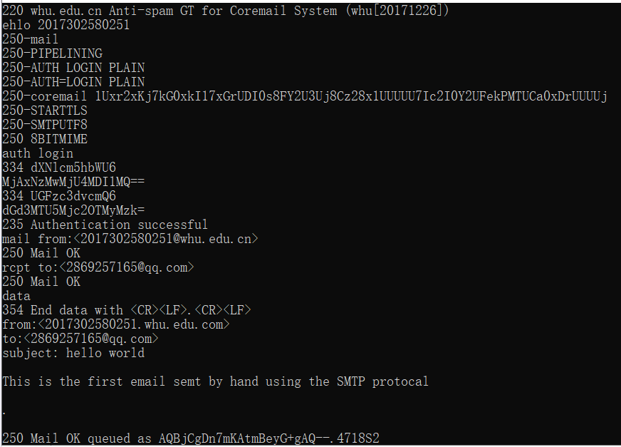

## telnet whu.edu.cn 25  
(1)与SMTP服务器建立连接:  输入telnet whu.edu.cn 25  
(2)SMTP服务器发送者的用户名: ehlo 2017302580251  
(3)选择登陆的方式：输入 auth login  
(4)输入账户名密码（base64加密后)  
(5)指明邮件发送者与接收者 ：mail from<2017302580251@whu.edu.dn>; rcpt to:<2869257165@qq.com>  
(6)输入data命令后编写邮件内容，输入“。”表示邮件内容输入结束  
(7)输入quit断开与服务器的连接  
命令行运行的结果为： 

成功收到邮件
## 课后习题  
### p1:  
(1)错误，客户端会发送四个请求，文本与三幅图像各一个请求，并且接收四个响应。  
(2)正确。持续连接可以供两个不同web页面使用  
(3)错误。使用非持续连接时，每次一个TCP报文只能携带一个HTTP服务请求报文  
(4)错误。HTTP响应报文的Data中包含的是所请求页面的数据信息。  
(5)错误。存在空的响应报文体。  
### p3:  
在应用层还需要DNS的参与，需要利用DNS将域名解析为对应的IP地址。在传输层需要TCP协议或UDP协议的参与来传输数据请求等。  
### p4: 
a:gaia/cs/umass/edu/cs453/index.html。第一行首部中包含  
b:1.1 。根据HTTP/1.1  
c:是一条持续的连接，由于存在保持连接keep-alive的信息;Connection:keep-alive  
d:报文中未包含运行主机的IP地址.  
e:浏览器类型为Mozilla/5.0。由于服务器可以可以针对不同的浏览器发送不同版本的网页。  
### p5: 
a:浏览器成功找到了那个文档。根据Date: Tue所得。回答的时间为响应浏览器的时间07 Mar 2008  
b:最后修改时间为Sat, 10 Dec 2005 18:27:46 GMT。根据Last-Modified的值而得  
c:被返回的字节为3874，根据Content-Length所得  
d:前五个字节为<!doc，服务器同意一条持续连接根据keep-alive可看出  
### p6:
a: 客户和服务器两者都能通知关闭持续连接。根据文档内容为：  
If either the client or the server sends the close token in the Connection header, that request becomes the last one for the connection.  

b: HTTP未提供任何的加密服务   

c: 客户与服务器最多只能打开2条并发连接。根据文档内容为  
Clients that use persistent connections SHOULD limit the number of simultaneous connections that they maintain to a given server. A single-user client SHOULD NOT maintain more than 2 connections with any server or proxy. A proxy SHOULD use up to 2*N connections to another server or proxy, where N is the number of simultaneously active users. These guidelines are intended to improve HTTP response times and avoid congestion.  

d: 存在这可能，根据文档规范  
A client, server, or proxy MAY close the transport connection at any time. For example, a client might have started to send a new request at the same time that the server has decided to close the "idle" connection. From the server's point of view, the connection is being closed while it was idle, but from the client's point of view, a request is in progress.
