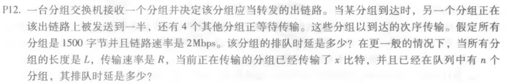
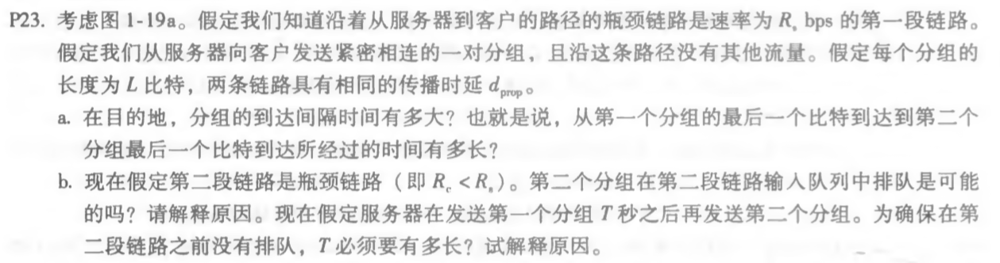

  a）dprop = m/s s 

  b）dtrans = L/R s

  c）de2e = dprop + dtrans = (m/s + L/s) s

  d）最后一个比特刚刚离开A

  e）第一个比特在链路上

  f）第一个比特已经到达B

  g）m/s = L/R	m = 535714 米

  

该分组的排队时延dqueue = 1500 x 8b / 2Mbps x 4.5 = 27ms

一般情况下dqueue = (n+(L-x)/L)L/R = ((n+1)L-x)/R

a) L/Rs s

b) 是可能的，只要L/Rc > L/Rs即可，依照题意此时第一个分组还在传输。
​    Tmin = L/Rc - L/Rs  解释：若无T秒，第二个分组到达时第一个分组传输了LRc/Rc,还剩L-LRc/Rc没传输完，所以只要把没传完的这部分除以速率Rc得到的时间即为所求。

