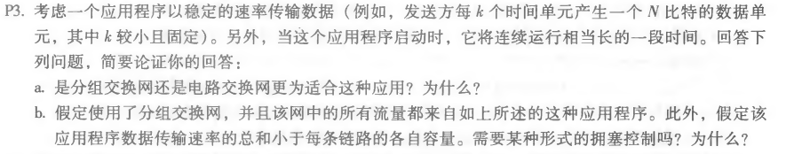
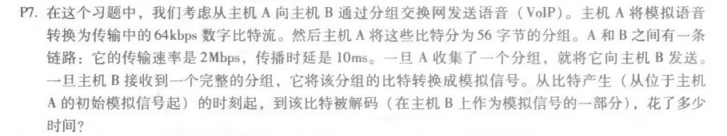
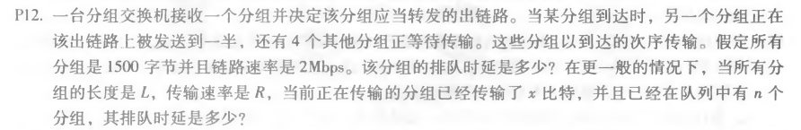

# 第二次作业
## 刘洋 2017302580294
P3:
a、电路交换网更适合这个应用，因为该应用以稳定的速率长时间运行，应该保留带宽。 
b、不需要，因为该应用程序的数据传输速率总和小于每条链路的各自容量，不会引起拥塞。 
P7:
时间T = (56 * 8b)/64kbps + (56 * 8b)/2Mbps + 10ms = 7ms + 0.224ms + 10ms = 17.224ms 
P12:
T = ((1500 * 8b)/2Mbps) * 4.5 = 0.6ms * 4.5 = 2.7ms