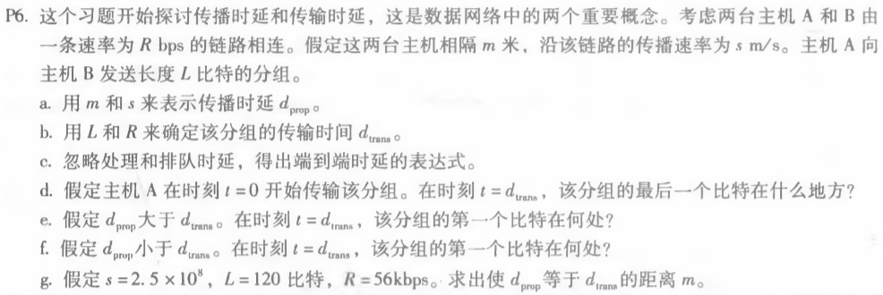
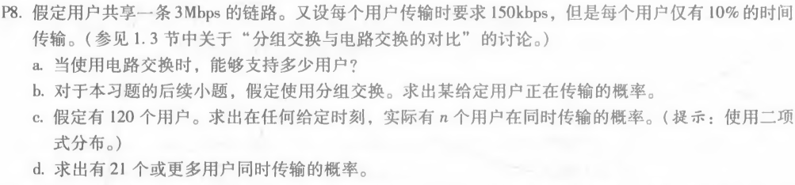

P6.

a. 传播时延dprop = 链路长度 / 传播速率 = m/s

b. 传输时延dtrans = 分组长度 / 链路传输速率 = L/R

c. 端到端时延表达式 dnodal = dprop + dtrans = m/s + L/R

d. 由于路由器推出该分组所需的时间是传输时延dtrans，在时刻t = dtrans时，该分组的最后一个比特刚刚离开路由器，进入链路

e. 假定dprop > dtrans，在时刻t = dtrans时，该分组的第一个比特仍在链路内，还未到达主机B所在的路由器

f. 假定dprop < dtrans，在时刻t = dtrans时，该分组的第一个比特已经到达主机B所在的路由器

g. 由dprop = dtrans，有m/s = L/R，代入得m = (120 bit * 2.5 * 10^8 m/s ) / (56 * 1000 bps) = 5.35 * 10^5 m

****

P8.

a. 对于电路交换 能支持的用户数为 3Mbps / 150kbps = 20

b. 给定用户正在传输的概率为0.1

c. n个用户在同时传输的概率为P(n) = C(120,n) * 0.1^n * 0.9^(120 - n)

d. 由c得，n个用户在同时传输得概率为C(120,n) * 0.1^n * 0.9^(120 - n)

故20个或者更少用户同时传输的概率P(<21) = P(0) + P(1) + ... + P(20)  = 0.997

所以21个或更多用户同时传输的概率为P(>=21) = 1 - P(<21) = 1 - P(0) - P(1) - ... - P(20)  = 0.003

 P16.

由传输时延为dtrans = 传输分组长度 / 链路传输速率 = L/R 

由N = 缓存中分组 + 传输的分组

则到达链路的分组速率a = N /d = (缓存中分组 + 传输的分组) / (排队时延 + 传输时延)

对于某个正在传输的分组：

有 a = (10 + 1) / (10ms + 1 / 100) = 550 分组/s

